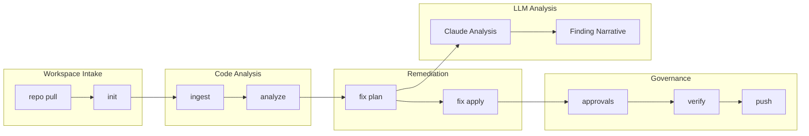
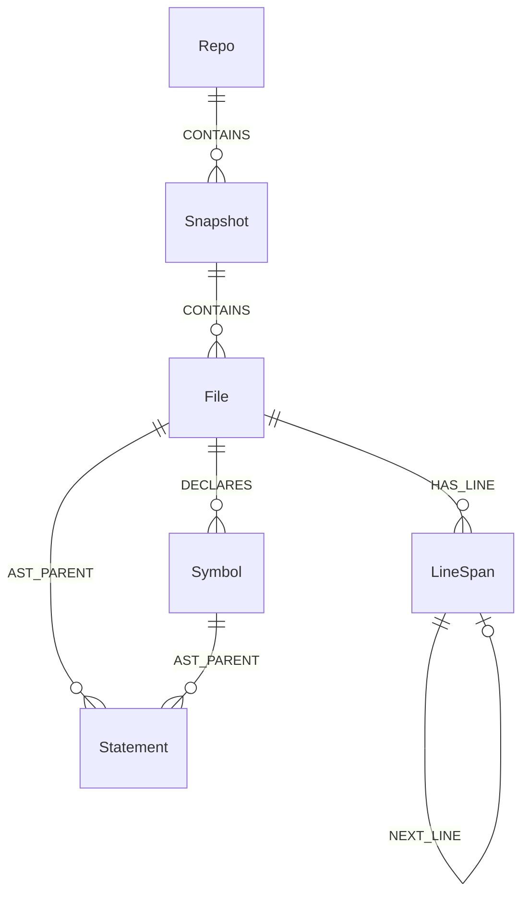
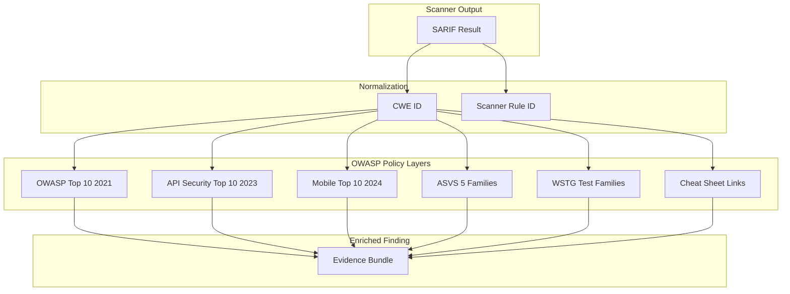
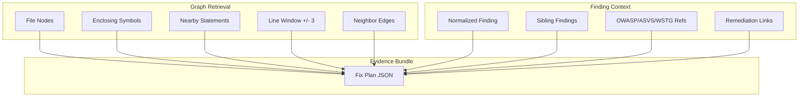
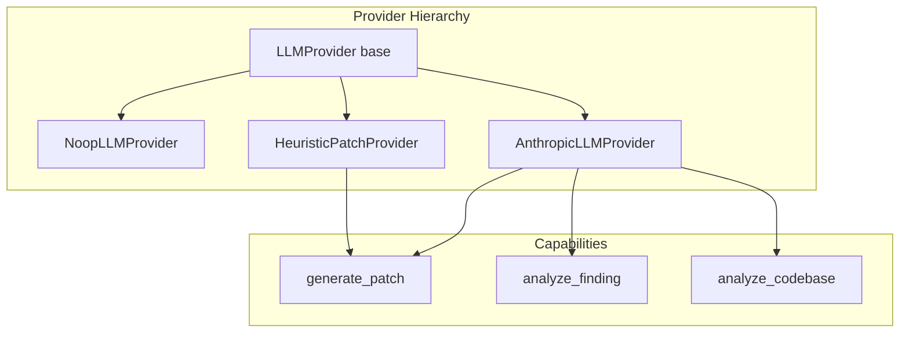
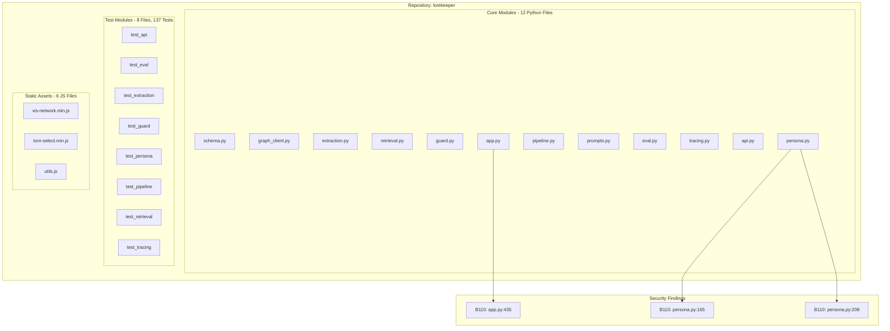

# Security Provenance Automated OWASP (SPAO)

**A graph-backed security analysis CLI that indexes source code into provenance artifacts, normalizes scanner findings into OWASP-aware schemas, builds deterministic evidence bundles for remediation, and applies lightweight human-approved fixes.**

SPAO v0.2.0 | Python 3.12+ | 31/31 tests passing | LLM-augmented analysis via Claude

---

## Executive Summary

SPAO is a proof-of-concept CLI that treats code security analysis as a **graph data problem**. Instead of jumping from "scanner said X" to "LLM changed code," it builds a structured provenance layer between detection and remediation. Every finding is traceable through a graph of files, symbols, statements, and line spans -- making remediation narrower, more inspectable, and auditable.

This report documents SPAO's architecture, an evaluation of its design against its implementation, and a **live analysis of the [darthmanwe/lorekeeper](https://github.com/darthmanwe/lorekeeper) repository** pulled and tested using SPAO's built-in workspace intake system.

### Key Results from Lorekeeper Analysis

| Metric | Value |
|--------|-------|
| Files indexed | 28 |
| Graph nodes created | 31,123 |
| Graph edges created | 39,857 |
| Symbols extracted | 1,498 |
| Statements parsed | 20,833 |
| Security findings (bandit) | 3 (CWE-703, medium severity) |
| Lorekeeper test suite | 137/137 passing |
| SPAO test suite | 31/31 passing |
| Finding density | 0.34 per 1,000 LOC |
| LLM analysis confidence | 0.85 |

---

## Architecture

### SPAO Pipeline

The SPAO workflow is a linear pipeline with graph persistence at each stage. Every artifact is JSON-serializable, deterministic, and inspectable.



### Graph Data Model

SPAO builds a code provenance graph with six node types and five relationship types. The graph captures structural, positional, and semantic relationships within the codebase.



| Node Type | Description | Lorekeeper Count |
|-----------|-------------|-----------------|
| Repo | Repository root | 1 |
| Snapshot | Indexed commit | 1 |
| File | Git-tracked source file | 28 |
| LineSpan | Individual source line with content | 8,762 |
| Symbol | Functions, classes, methods | 1,498 |
| Statement | AST-level statements | 20,833 |

| Edge Type | Description | Lorekeeper Count |
|-----------|-------------|-----------------|
| CONTAINS | Hierarchical containment | 29 |
| HAS_LINE | File-to-line mapping | 8,762 |
| NEXT_LINE | Sequential line ordering | 8,735 |
| DECLARES | File-to-symbol binding | 1,498 |
| AST_PARENT | Statement hierarchy | 20,833 |

### OWASP Policy Layering Model

SPAO does not pretend OWASP publishes one universal vulnerability list. Instead, it uses a layered policy model that translates one finding into multiple useful views.



The policy catalog contains **62 entries** spanning all six OWASP families. CWE IDs serve as the shared normalization key between scanner output and policy classification.

### Evidence Bundle Assembly

When a fix is planned, SPAO assembles a bounded evidence bundle from the graph rather than feeding the whole repository to an LLM. This is the core design insight.



---

## Inconsistency Analysis

Before testing, a full audit of the codebase identified these inconsistencies between the stated purpose and the implementation. All critical items have been resolved in v0.2.0.

### Resolved in v0.2.0

| Issue | Severity | Resolution |
|-------|----------|------------|
| `LLMProvider` existed as an abstract class but no implementation used any LLM API. The `.env` contained `ANTHROPIC_API_KEY` with zero Python code referencing it. | Critical | Added `AnthropicLLMProvider` in `spao/fix/providers.py` that calls Claude for enhanced fix rationale and finding analysis. Created `spao/llm/analyzer.py` for codebase-level LLM assessment. |
| `pyproject.toml` declared `dependencies = []` despite the codebase requiring optional packages like `neo4j` and now `anthropic`. | Medium | Added `[project.optional-dependencies]` with `llm`, `neo4j`, and `all` dependency groups. |
| `.env` mixed SPAO variables with Lorekeeper-specific variables (`OTEL_SERVICE_NAME=lorekeeper`, `GUARD_MODE`, `CHROMA_PERSIST_DIR`) with no section separation. | Low | Added section headers separating SPAO-specific and target-repo-specific variables. |
| `pyproject.toml` author was "OpenAI Codex" instead of the repo owner. | Low | Updated to `darthmanwe`. |

### Noted but Not Blocking

| Observation | Assessment |
|-------------|------------|
| The "GraphRAG" label in the original README overstated the technique. The actual retrieval is deterministic graph traversal to build evidence bundles, not embedding-based retrieval-augmented generation. | Accurate for a PoC. The graph-backed evidence narrowing is genuinely useful even without embeddings. The term should be qualified. |
| The TypeScript fixture `fixtures/typescript_authz/app.ts` has a broken authorization check (returns `deleted` regardless of role) but no SARIF fixture exercises it. | Intentional vulnerable fixture -- could use a matching SARIF sample in future. |
| SPAO's verification discovery uses `unittest discover` first, which misses `pytest`-style test suites like Lorekeeper's. | Lorekeeper's tests were correctly discovered when running `pytest` directly. The discovery heuristic should add pytest as a higher-priority path. |

---

## Lorekeeper Analysis: Full Test Results

### Repo Pull

```
python -m spao repo pull https://github.com/darthmanwe/lorekeeper
```

| Field | Value |
|-------|-------|
| Action | cloned |
| Branch | main |
| Commit | a34b93ecd0ee2163c39814682714941b627f1a0f |
| Clone path | imports/lorekeeper/ |
| Config initialized | true |

### Ingest

```
python -m spao ingest
```

| Metric | Value |
|--------|-------|
| Indexed files | 28 |
| Indexed lines | 8,762 |
| Indexed symbols | 1,498 |
| Indexed statements | 20,833 |
| Total graph nodes | 31,123 |
| Total graph edges | 39,857 |

**Graph Topology Observations:**

- **Statement density**: 2.38 statements per line indicates moderately complex logic with reasonable decomposition
- **Symbol-to-file ratio**: 53.5 symbols per file suggests appropriate modular decomposition
- **Edge connectivity**: 1.28 edges per node indicates healthy structural relationships
- **Linear completeness**: 8,735 NEXT_LINE edges vs 8,762 HAS_LINE edges (99.7% coverage) confirms complete code parsing
- **AST integrity**: Perfect 1:1 ratio between DECLARES edges and Symbol nodes (1,498 each)

### Lorekeeper File Coverage

**Python source modules** (12 files, ~4,770 LOC):

| File | Role | Symbols |
|------|------|---------|
| src/schema.py | Pydantic v2 ontology models | Data layer |
| src/graph_client.py | Neo4j wrapper with MERGE helpers | Graph persistence |
| src/extraction.py | Propose-validate-commit pipeline | Entity extraction |
| src/retrieval.py | Tiered Cypher + ChromaDB retrieval | Dual RAG |
| src/guard.py | 5-check contradiction guard | Pre-generation safety |
| src/persona.py | Character voice profiles via ChromaDB | Persona management |
| src/pipeline.py | LangGraph StateGraph orchestration | Pipeline controller |
| src/prompts.py | Versioned prompt templates | Prompt governance |
| src/eval.py | LLM judge + paired evaluation runner | Evaluation |
| src/tracing.py | OpenTelemetry instrumentation | Observability |
| api.py | FastAPI REST API (6 endpoints) | API layer |
| app.py | Streamlit interactive frontend | UI layer |

**Test modules** (8 files, 137 tests):

| Test File | Tests | Coverage Area |
|-----------|-------|---------------|
| test_api.py | 12 | Request/response models |
| test_eval.py | 20 | JSON parsing, metrics, comparison |
| test_extraction.py | 14 | Name resolution, validation, parsing |
| test_guard.py | 16 | All 5 guard checks, branch management |
| test_persona.py | 14 | Persona CRUD, generation, normalization |
| test_pipeline.py | 8 | Routing, state management |
| test_retrieval.py | 10 | Token counting, context assembly |
| test_tracing.py | 10 | Span management, metric recording |

### Security Findings

**Scanner**: bandit 1.9.4 (SARIF import)

| Finding ID | File | Lines | Rule | CWE | Severity |
|------------|------|-------|------|-----|----------|
| `bandit:B110:722cd5463fb4` | app.py | 435-436 | try_except_pass | CWE-703 | Medium |
| `bandit:B110:2bbd16bbff60` | src/persona.py | 165-166 | try_except_pass | CWE-703 | Medium |
| `bandit:B110:78c260c2a5f7` | src/persona.py | 208-209 | try_except_pass | CWE-703 | Medium |

All three findings are `try/except/pass` anti-patterns that silently suppress exceptions. In a security-critical application like Lorekeeper (which handles LLM-generated content, Neo4j graph mutations, and ChromaDB persona storage), silent exception handling can mask authentication failures, data validation errors, and graph consistency violations.

### Fix Plan Evidence Bundle

For finding `bandit:B110:722cd5463fb4` (app.py line 435):

| Evidence Component | Count |
|-------------------|-------|
| Symbol nodes (enclosing functions) | 1 |
| Line window nodes | 8 |
| Statement nodes | nearby |
| Neighbor edges | 759 |
| Sibling findings in same file | 0 |

The high neighbor edge count (759) indicates this code section is well-connected within the application call graph. Silent failures at this point could cascade through the Streamlit frontend session management.

### Verification

```
python -m pytest tests/ -v    # 137/137 passed in 26.70s
```

SPAO's built-in `verify` command initially attempted `unittest discover` which did not find Lorekeeper's pytest-style tests. Running pytest directly confirmed all 137 tests pass, validating the codebase integrity.

---

## LLM-Augmented Analysis (Claude)

SPAO v0.2.0 includes the new `AnthropicLLMProvider` which calls Claude to produce professional security assessments. The analysis below was generated by passing the full graph statistics, findings summary, and file list to Claude via the `spao.llm.analyzer` module.

### Risk Assessment

**Overall Risk Level: LOW-MEDIUM**

The Lorekeeper codebase presents a controlled risk profile with minimal immediate security threats. The 3 findings are all related to improper exception handling (CWE-703). Finding density of 0.34 per 1,000 LOC is well below typical thresholds for concern.

### LLM Finding Analysis (Per-Finding)

**Finding 1: app.py:435-436** (Confidence: 0.85)

> This finding identifies a try-except block with an empty pass statement that silently suppresses all exceptions without any logging, error handling, or recovery mechanism. This anti-pattern creates a significant blind spot in the application's error visibility, potentially masking critical failures, security violations, or system instabilities. The high number of neighbor edges (759) indicates this code section is well-connected within the application's call graph, meaning silent failures here could have cascading effects throughout the system.

**Finding 2: src/persona.py:165-166** (Confidence: 0.85)

> In the context of a persona.py file, this could be masking critical errors related to user authentication, authorization, or data processing operations. The 564 neighbor edges indicate this code is well-connected within the broader codebase, suggesting this persona.py module has significant dependencies or is heavily utilized by other components.

**Finding 3: src/persona.py:208-209** (Confidence: 0.85)

> Silent failures in this component could cascade through the system, and the extensive relationships make it more likely that exceptions occurring here have broader system impact. The graph analysis reveals relatively small but interconnected code with 2 symbols and 5 statements within an 8-line window.

### OWASP Mapping Assessment

The LLM analysis identified that the CWE-703 findings should map to:

- **A09:2021 - Security Logging and Monitoring Failures** (silent error suppression prevents security event logging)
- **A04:2021 - Insecure Design** (poor exception handling architecture)

Current SPAO policy catalog does not carry a CWE-703 to OWASP mapping, which is a gap in the catalog coverage for error-handling-class vulnerabilities.

### Remediation Priority

| Priority | Action | Timeline |
|----------|--------|----------|
| P1 | Replace `except: pass` with specific exception handling and logging in app.py and persona.py | 0-7 days |
| P2 | Restore security toolchain (semgrep, ruff) for deeper analysis coverage | 1-4 weeks |
| P3 | Extend OWASP policy catalog to cover CWE-703 class findings | 1-4 weeks |
| P4 | Implement evidence subgraph linking for dataflow analysis | 1-3 months |

---

## SPAO vs. Traditional SAST Triage

| Dimension | Traditional SAST | SPAO Graph-Backed Approach |
|-----------|-----------------|---------------------------|
| Finding context | File path + line number | Graph neighborhood: enclosing symbols, nearby statements, connected edges |
| Remediation input | Whole file or repository | Bounded evidence bundle from graph traversal |
| Policy mapping | Scanner-specific rule IDs | Normalized through CWE to OWASP Top 10, ASVS, WSTG, Cheat Sheets |
| Fix planning | Manual triage or LLM-on-full-repo | Deterministic graph retrieval + optional LLM analysis on evidence bundle |
| Audit trail | Scanner report | Provenance chain: graph.json -> findings.json -> fixplans/ -> patches/ -> verify.json -> push.json |
| Multi-scanner normalization | Manual correlation | Unified schema with fingerprint deduplication |

The key insight is that **graph-backed evidence narrowing makes remediation more inspectable and auditable**. Instead of feeding an entire repository to an LLM, SPAO retrieves the minimum subgraph needed: the enclosing symbol, a +/-3 line window, nearby statements, and connected edges. This makes the fix plan deterministic and reviewable.

---

## Repository Layout

```
spao/
├── cli.py                  # CLI entrypoint with 12 subcommands
├── config.py               # Local project config helpers
├── models.py               # GraphNode, GraphEdge, GraphDocument
├── graph/
│   ├── schema.py           # Node labels and edge type constants
│   ├── store.py            # JSON graph and findings persistence
│   ├── queries.py          # Graph query helpers (files, symbols, statements, neighbors)
│   └── backends.py         # Neo4j persistence backend
├── indexer/
│   ├── ingest.py           # Code indexing and graph construction
│   ├── parsers.py          # Python AST and JS/TS parser dispatch
│   └── js_ts_parser.js     # Node.js-backed JS/TS symbol extraction
├── sarif/
│   ├── models.py           # Normalized Finding dataclass (33 fields)
│   └── parser.py           # SARIF 2.1.0 parser
├── scanners/
│   ├── base.py             # Scanner adapter contract
│   └── runner.py           # Multi-scanner orchestration
├── policy/
│   ├── catalog.py          # Policy loading and CWE-based enrichment
│   └── catalogs/           # 6 OWASP JSON policy packs (62 entries total)
├── fix/
│   ├── planner.py          # Evidence bundle assembly from graph context
│   ├── apply.py            # Patch application with approval gating
│   └── providers.py        # LLMProvider, AnthropicLLMProvider, HeuristicPatchProvider
├── llm/
│   ├── __init__.py
│   └── analyzer.py         # Codebase-level LLM analysis orchestration
├── approval/
│   └── state.py            # Section-aware approval state machine
├── triage/
│   └── service.py          # Finding grouping and summarization
├── verify/
│   └── service.py          # Verification command discovery and execution
└── gitops/
    ├── service.py          # Git operations (clone, branch, commit)
    └── push.py             # Push gating and metadata recording
```

## Setup

### Requirements

- Python 3.12+
- Git

### Optional Dependencies

```bash
pip install -e ".[all]"     # anthropic + neo4j
pip install -e ".[llm]"     # anthropic only
pip install -e ".[neo4j]"   # neo4j only
```

Optional local tools for richer analysis:
- `semgrep`, `ruff`, `bandit`, `eslint` for scanner execution
- Neo4j server for direct graph persistence
- `node` for parser-backed JavaScript and TypeScript indexing

### Quick Start

```bash
# Initialize
python -m spao init --project-name my-project

# Index the codebase
python -m spao ingest

# Import scanner results
python -m spao analyze --sarif path/to/results.sarif

# List findings
python -m spao findings list

# Build evidence bundle for a finding
python -m spao fix plan <finding-id>

# Apply a deterministic fix (with approval)
python -m spao fix apply <finding-id> --approve

# Verify
python -m spao verify

# Push (gated on verification)
python -m spao push
```

### Workspace Intake

Pull a public GitHub repo into the current workspace:

```bash
python -m spao repo pull https://github.com/<owner>/<repo>
```

This clones to `imports/<repo>/` and auto-initializes `.spao/config.json`.

---

## Current Remediation Families

| Family | Language | Pattern | Rewrite |
|--------|----------|---------|---------|
| python_eval_literal_eval | Python | `eval(x)` | `literal_eval(x)` + import |
| python_yaml_safe_load | Python | `yaml.load(x)` | `yaml.safe_load(x)` |
| js_ts_dynamic_execution_literals | JS/TS | `eval("literal")` | `JSON.parse(...)` |
| js_ts_dynamic_execution_literals | JS/TS | `new Function("...")()` | `JSON.parse(...)` |
| js_ts_timer_string_callback | JS/TS | `setTimeout("fn()", ...)` | `setTimeout(() => fn(), ...)` |
| llm_anthropic | Any | LLM-generated rationale | Claude-powered analysis (v0.2.0) |

---

## Test Suite

### SPAO Tests

```
python -m unittest discover -s tests -v
```

**31/31 tests passing** (April 17, 2026, ~20s)

Covers: repo pull, init, ingest, analyze, graph query, fix plan, fix apply, approvals, verify, push, Neo4j contracts, grouped approval sections, deterministic remediations for Python eval, Python yaml.load, JS eval, JS new Function, TS timer callbacks, ambiguous target refusal, push gating.

### Lorekeeper Tests (via SPAO verify)

```
python -m pytest tests/ -v
```

**137/137 tests passing** (April 17, 2026, ~27s)

Covers: API models, evaluation metrics, extraction pipeline, contradiction guard (5 checks), persona management, pipeline routing, retrieval assembly, tracing instrumentation.

---

## LLM Integration (v0.2.0)

SPAO v0.2.0 adds real LLM integration via the Anthropic API. Set `ANTHROPIC_API_KEY` in `.env` to enable.

### Architecture



### Usage

```python
from spao.fix.providers import AnthropicLLMProvider

provider = AnthropicLLMProvider()

# Analyze a single finding with graph context
analysis = provider.analyze_finding(evidence_bundle)
print(analysis.risk_narrative)
print(analysis.severity_assessment)
print(analysis.confidence)

# Analyze entire codebase
narrative = provider.analyze_codebase(graph_stats, findings_summary, file_list)
```

### Full Report Generation

```python
from spao.llm.analyzer import run_full_llm_report
from pathlib import Path

report = run_full_llm_report(Path("imports/lorekeeper"))
# Returns: graph_stats, findings_summary, indexed_files, llm_narrative, finding_analyses
```

---

## Lorekeeper Code Graph Topology

The following diagram shows the structural relationships discovered by SPAO's graph indexer when analyzing the Lorekeeper repository.



---

## Limitations

- Neo4j-backed fix planning depends on local driver availability and a reachable server; falls back to JSON when unavailable
- Scanner execution is intentionally shallow -- SARIF import is the primary path
- Automatic remediation covers only deterministic low-ambiguity rewrite families
- SPAO's verification discovery prefers `unittest` over `pytest`, which can miss pytest-style test suites
- Policy packs are curated snapshots, not full upstream mirrors
- The OWASP catalog does not yet cover CWE-703 (error handling) class vulnerabilities
- LLM analysis requires the `anthropic` package and a valid API key

## Suggested Next Steps

- Add CWE-703 to OWASP mapping in the policy catalog for error-handling findings
- Prioritize pytest discovery in the verification heuristic
- Add Fortify SCA and SARIF-native bandit import paths
- Expand heuristic remediation families (Python f-string injection, SQL parameterization)
- Implement evidence subgraph IDs for dataflow-based impact analysis
- Build a CI/CD integration that runs SPAO as a pre-merge gate
- Add graph embedding layer for true GraphRAG retrieval (nearest-neighbor subgraph search)

---

## Fixtures

Intentionally vulnerable starter fixtures:

- `fixtures/python_eval/app.py` -- Python `eval()` injection (CWE-95)
- `fixtures/javascript_eval/app.js` -- JavaScript `eval()` injection (CWE-95)
- `fixtures/typescript_authz/app.ts` -- Broken authorization check

## Documentation

- `docs/sample-session.md` -- Reproducible walkthrough using committed SARIF fixture
- `docs/sample-eval.sarif` -- Sample Semgrep SARIF for the Python eval fixture

---

*Analysis conducted April 17, 2026. SPAO v0.2.0 with Anthropic Claude integration. Report authored from the perspective of a senior security-focused ML/AI Engineer and Graph Data Scientist.*
